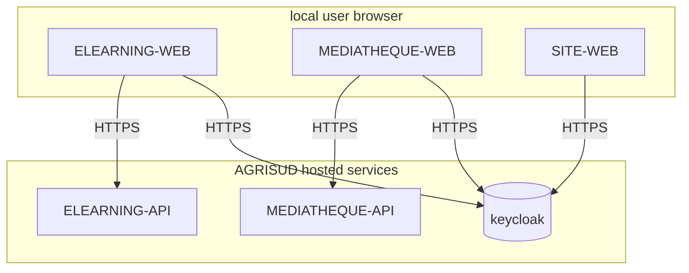

[AGRISUD] AGRISUD-ELEARNING-API 
=============================
ELEARNING API for AGRISUD.

Structure
--------

Overall structure in production environment:

Note: The structure is simplified in development environment:  
- keycloak is bootstrapped with mocked users,
- there are no firewall and no HTTPS between front apps and backends.

Dev environment
--------

to get started with all the tools you need to start working on MEDIATHEQUE API, click [here](./docs/getting-started.md)
